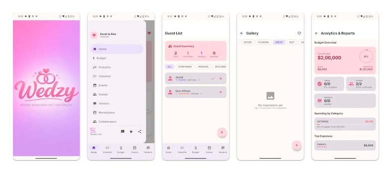

# Wedzy — Wedding Planner Android App

**A comprehensive wedding planning app for Android that helps engaged couples plan, organize, and execute their special day — all in one place.**

---

## Screenshots

---

## Overview

Wedzy is a full-featured wedding planner app built for Android using Kotlin and Jetpack Compose. It provides complete user data isolation, secure Firebase authentication, and an intuitive UI to manage every aspect of a wedding.

---

## Key Features

### Home Dashboard
- Live wedding countdown (days, hours, minutes, seconds)
- Quick-overview cards for budget, guests, vendors, and gallery
- Upcoming tasks with priority indicators
- Custom hero background image with persistent storage

### Task Management
- Full CRUD — create, edit, delete tasks
- Priority levels: Low, Medium, High
- Categories: Venue, Catering, Photography, Decor, Transportation, and more
- Due date tracking with overdue alerts
- Status filtering: All, Pending, In Progress, Completed, Overdue

### Budget Tracker
- Overall budget setting and category-based expense tracking
- Estimated vs. actual cost comparison
- Payment status: Not Paid, Partially Paid, Fully Paid
- Dynamic currency support (USD, INR, and more)
- Real-time remaining budget calculations

### Guest List Management
- Comprehensive guest profiles with RSVP tracking
- Guest side assignment: Bride, Groom, Mutual
- Plus-one management, dietary restrictions, table assignments
- Thank-you card tracking for gifts

### Vendor Management
- Vendor directory by category (Photographer, Caterer, Venue, etc.)
- Status tracking: Researching → Booked → Completed
- Quoted vs. agreed pricing, deposit amounts
- Contact info, notes, and photo gallery per vendor

### Inspiration Gallery
- Personal photo gallery with 15+ category tags
- Camera and gallery integration
- Favorite marking for preferred inspirations
- All images stored locally — no cloud uploads

### Calendar & Events
- Wedding event planning with timelines
- Custom event types, date/time management

### Security & Privacy
- Firebase Authentication (email/password + Google Sign-In)
- Complete user data isolation — each account is fully separate
- No data shared between users

---

## Tech Stack

| Layer | Technology |
|---|---|
| Language | Kotlin |
| UI | Jetpack Compose + Material 3 |
| Architecture | MVVM + Clean Architecture |
| Backend | Firebase (Auth, Firestore, Storage) |
| Local DB | Room |
| Async | Kotlin Coroutines + Flow |
| DI | Hilt |
| Navigation | Jetpack Navigation Compose |
| Image Loading | Coil |

---

## Requirements

- **Minimum SDK:** Android 7.0 (API 24)
- **Target SDK:** Android 14 (API 34)

---

## Source Code

This is a showcase repository. The full source code is private and proprietary.  
For collaboration or code review inquiries, please reach out directly.

---

## Developer

**Ajith Prasad PV**  
Android Developer

